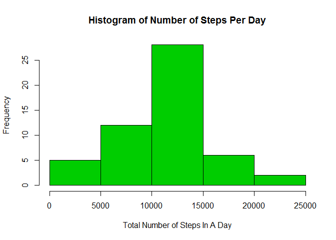
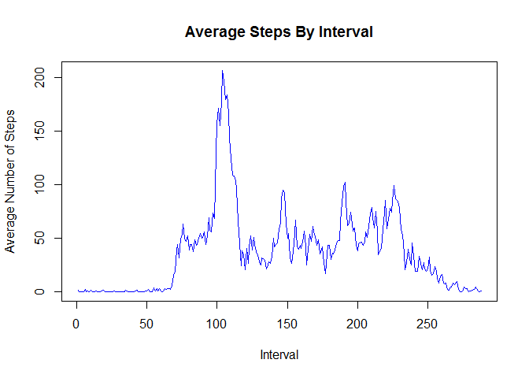
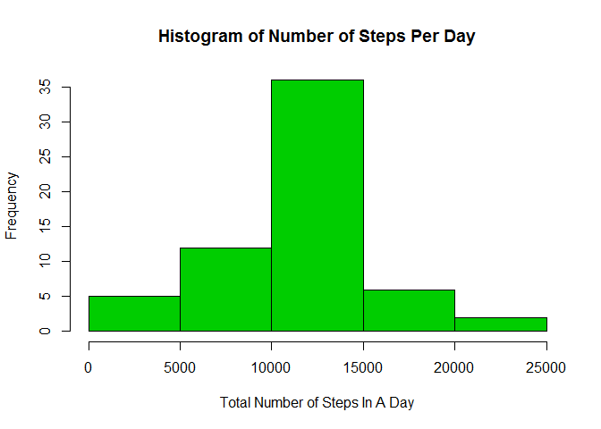
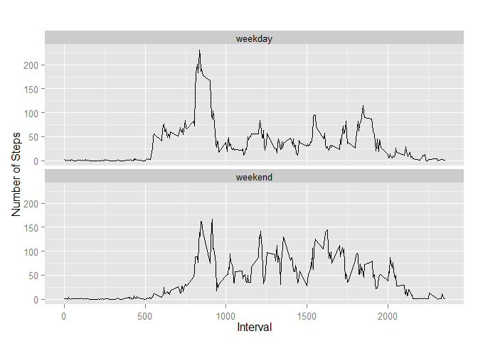

# Reproducible Research: Peer Assessment 1


## Loading and preprocessing the data

1. Load the data (i.e. read.csv()).
2. Process/transform the data (if necessary) into a format suitable for your analysis.


```r
#download the remote file
remoteFile <- "http://d396qusza40orc.cloudfront.net/repdata%2Fdata%2Factivity.zip"
tempDir <- tempdir()
temp <- tempfile(tmpdir=tempDir, fileext=".zip")
download.file(remoteFile,temp)

#unzip the remote file
extractFilename = unzip(temp, list=TRUE)$Name[1]
unzip(temp, files=extractFilename, exdir=tempDir, overwrite=TRUE)
extractedFile <- file.path(tempDir, extractFilename)

#read the extracted file
activity <- read.csv(extractedFile,as.is=TRUE)
```

## What is mean total number of steps taken per day?

1. Make a histogram of the total number of steps taken each day.


```r
#aggregate the number of steps by date
activityByDate <- aggregate(steps ~ date,activity,sum)

#output the histogram of the number of steps
hist(activityByDate$steps,col=3,main="Histogram of Number of Steps Per Day",
     xlab="Total Number of Steps In A Day")
```

 

2. Calculate and report the mean and median total number of steps taken per day.


```r
#calculate the mean and median number of steps
averageNumSteps <- mean(activityByDate$steps)
medianNumSteps <- median(activityByDate$steps)
```

The mean number of steps is 10766.19.  
The median number of steps is 10765.

## What is the average daily activity pattern?

1. Make a time series plot (i.e. type = "l") of the 5-minute interval (x-axis) and the average number of steps taken, averaged across all days (y-axis).


```r
#aggregate the mean number of steps by interval
meanByInterval <- aggregate(steps ~ interval,activity,mean)

#plot a line graph of the average steps by interval
plot(meanByInterval$steps,type="l",col=4,main="Average Steps By Interval",ylab="Average Number of Steps",xlab="Interval")
```

 

2. Which 5-minute interval, on average across all the days in the dataset, contains the maximum number of steps?


```r
#determine which row has most steps
maxStepsRow <- which.max(meanByInterval$steps)

#find the interval with the max number of steps
maxInterval <- meanByInterval[maxStepsRow,]$interval
maxSteps <- meanByInterval[maxStepsRow,]$steps
```

The interval with the average maximum number of steps is 835, representing 206.1698113 steps.  

## Imputing missing values

Note that there are a number of days/intervals where there are missing values (coded as NA). The presence of missing days may introduce bias into some calculations or summaries of the data.  

1. Calculate and report the total number of missing values in the dataset (i.e. the total number of rows with NAs).


```r
#determine how many rows are missing data
missingValues <- activity[!complete.cases(activity),]
nrow(missingValues)
```

```
## [1] 2304
```

2. Devise a strategy for filling in all of the missing values in the dataset. The strategy does not need to be sophisticated. For example, you could use the mean/median for that day, or the mean for that 5-minute interval, etc.

The strategy chosen for this analysis is to use the interval mean to replace the missing values. This strategy is implemented in part 3 below.

3. Create a new dataset that is equal to the original dataset but with the missing data filled in.


```r
#create an imputed data frame, using the interval mean to replace
#missing values
imputedData <- activity
for (i in 1:nrow(imputedData)){
  if (is.na(imputedData$steps[i])){
    interval <- imputedData$interval[i]
    rowId <- which(meanByInterval$interval == interval)
    steps <- meanByInterval$steps[rowId]
    imputedData$steps[i] <- steps
  }
}
```

4. Make a histogram of the total number of steps taken each day and Calculate and report the mean and median total number of steps taken per day. Do these values differ from the estimates from the first part of the assignment? What is the impact of imputing missing data on the estimates of the total daily number of steps?


```r
#using the new data frame, aggregate the number of steps by date
imputedStepsByDate <- aggregate(steps ~ date,imputedData,sum)

#output a histogram of the imputed data
hist(imputedStepsByDate$steps,col=3,main="Histogram of Number of Steps Per Day",
     xlab="Total Number of Steps In A Day")
```

 

```r
#calculate the mean and median of the number of steps in the imputed data frame
imputedAverageNumSteps <- mean(imputedStepsByDate$steps)
imputedMedianNumSteps <- median(imputedStepsByDate$steps)
```

The mean number of steps is 10766.19.  
The median number of steps is 10766.19.  

In comparison with the mean and median of the original data set, the mean remained the same, while the median value got higher.

## Are there differences in activity patterns between weekdays and weekends?

1. Create a new factor variable in the dataset with two levels - "weekday" and "weekend" indicating whether a given date is a weekday or weekend day.


```r
#convert the string date into a Date
imputedData$date <- as.Date(imputedData$date,"%Y-%m-%d")

#determine day of the week for each Date
imputedData$dayOfTheWeek <- weekdays(imputedData$date)

#determine whether the day is a weekend or not
for (i in 1:nrow(imputedData)) {
  if (imputedData$dayOfTheWeek[i] == "Saturday" || 
      imputedData$dayOfTheWeek[i] == "Sunday") {
    imputedData$dayGroup[i] <- "weekend"
  } else {
    imputedData$dayGroup[i] <- "weekday"
  }
}

#change from string to a factor
imputedData$dayGroup <- as.factor(imputedData$dayGroup)
```

2. Make a panel plot containing a time series plot (i.e. type = "l") of the 5-minute interval (x-axis) and the average number of steps taken, averaged across all weekday days or weekend days (y-axis).


```r
#aggregate the average steps over each interval
meanIntervalStepsDayGroup <- aggregate(steps ~ interval+dayGroup, imputedData, mean)

library(ggplot2)
```

```
## Warning: package 'ggplot2' was built under R version 3.1.2
```

```r
#generate a line graph comparing the weekday steps to the weekend steps
qplot(interval, steps, data=meanIntervalStepsDayGroup, geom=c("line"), 
      xlab="Interval", ylab="Number of Steps", main="") + facet_wrap(~ dayGroup, ncol=1)
```

 
